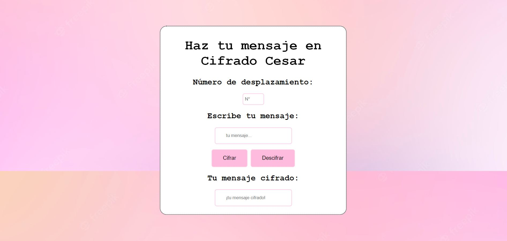

# Haz tu mensaje en Cifrado César

<<<<<<< HEAD

## Haz tu mensaje en Cifrado César
"Haz tu mensaje en Cifrado César" es una pagina que le permite usted cifrar y descifrar un mensaje con un numero de desplazamiento a su elección.

=======
## Haz tu mensaje en Cifrado César
"Haz tu mensaje en Cifrado César" es una pagina que le permite usted cifrar y descifrar un mensaje con un numero de desplazamiento a su elección.

>>>>>>> 8f011159b02daf977b87c6228d12a508bded2023
## Vistas del proyecto

primera vista en papel

vista de la pagina web 

## Instrucciones de uso

**Para Cifrar:**

* elegir un offset de desplazamiento.

* ingresar texto a cifrar.

* oprime boton "cifrar".

* recibe tu mensaje 

**Para Descifrar:**

* elegir un offset de desplazamiento (el mismo que se utiliza para codificar).

* ingresar texto a descifrar.

* oprima el boton "descifrar".

* recibe tu mensaje 
