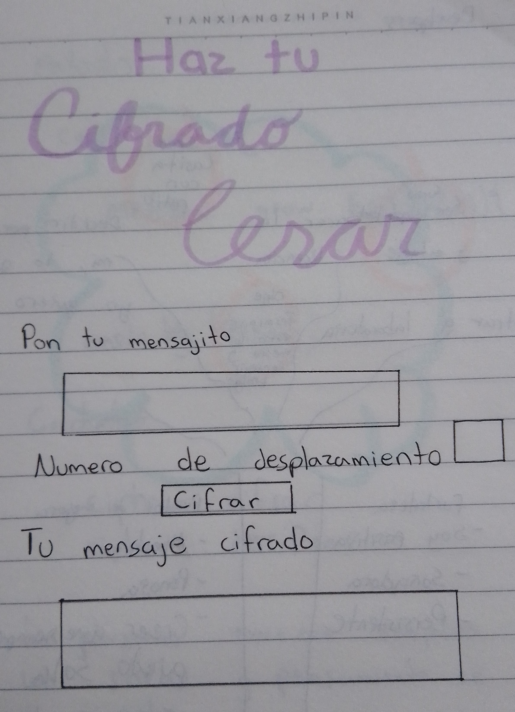

# Haz tu mensaje en Cifrado César

## Índice

* [1. Objetivos de aprendizaje generales](#1-objetivos-de-aprendizaje-generales)

***

## Haz tu mensaje en Cifrado César
"Haz tu mensaje en Cifrado César" es una pagina que le permite usted cifrar y descifrar un mensaje con un numero de desplazamiento a su elección.

* Un _boilerplate_, la estructura básica de un proyecto en distintas carpetas (a través `modulos` en JS).

## Vistas del proyecto

Cifrar significa codificar

Por ejemplo, si usamos un desplazamiento (_offset_) de 3 posiciones:

* La letra A se cifra como D.
* La palabra CASA se cifra como FDVD.
* Alfabeto sin cifrar: A B C D E F G H I J K L M N O P Q R S T U V W X Y Z
* Alfabeto cifrado: D E F G H I J K L M N O P Q R S T U V W X Y Z A B C

En la actualidad, todos los cifrados de sustitución simple se descifran con
mucha facilidad y, aunque en la práctica no ofrecen mucha seguridad en la
comunicación por sí mismos; el cifrado César sí puede formar parte de sistemas
más complejos de codificación, como el cifrado Vigenère, e incluso tiene
aplicación en el sistema ROT13.

## 3. Resumen del proyecto

En este proyecto crearás una aplicación web que servirá para que tu usuaria
pueda cifrar y descifrar un texto en el navegador indicando un desplazamiento específico de
caracteres (_offset_). Lo harás utilizando HTML, CSS y JavaScript.

La temática es libre. Piensa en qué situaciones se necesitaría cifrar un mensaje. Decide 
cómo debe ser esa experiencia de uso (qué pantallas, explicaciones, mensajes, colores, etc.) 
Algunas ideas de ejemplo:

* Crear claves seguras para el email.
* Encriptar/cifrar una tarjeta de crédito.
* Herramienta de mensajería interna de una organización de derechos humanos en
  una zona de conflicto.
* Mensajería secreta para parejas.

## 4. Consideraciones generales

* Este proyecto lo resolvemos de manera individual. Te recomendamos una duracion de 1-3 sprints.
* Enfócate en aprender y no solamente en "completar" el proyecto. Te va a costar.
* Te sugerimos que no intentes saberlo todo antes de empezar a codear. No te preocupes demasiado ahora por lo que _todavía_ no entiendas. Irás aprendiendo.

## 5. Hito 1: Criterios de aceptación mínimos del proyecto 

Estos son los requisitos que tu proyecto debe que cumplir para asegurar que tu trabajo cubra los objetivos principales.  

**1. Una interfaz que debe permitir a la usuaria:**

  * **Cifrar un mensaje**
    * Insertar el mensaje (texto) que quiere cifrar. El mensaje usa alfabeto simplificado (solamente mayúsculas y sin ñ).
    * Elegir un numero de desplazamiento (_offset_) indicando cuántas posiciones quieres que
  el cifrado desplace cada caracter en el alfabeto. El numero sera positivo y entero (positive integer).
    * Ver el resultado del mensaje cifrado.

 * **Descifrar un mensaje**
    * Insertar el mensaje (texto) que quieres descifrar. El mensaje usa alfabeto simplificado (solamente mayúsculas y sin ñ).
    * Elegir un numero desplazamiento (_offset_, que corresponda al que usamos para cifrar) indicando cuántas posiciones quieres que
  el cifrado desplace cada caracter en el alfabeto. El numero sera positivo y entero (positive integer).
    * Ver el resultado del mensaje descifrado.

**2. Pruebas unitarios de los métodos.**  
  Los metódos de `cipher` (`encode` y `decode`) deben tener cobertura con pruebas unitarias.

**3. Código de tu proyecto subido a tu repo y interfaz "desplegada".**  
  El código final debe estar subido en un repositorio en GitHub. La interfaz o pagina web, debe ser "desplegada" usando GitHub Pages.

**4. Un README que contiene una definición del producto.**  
  En el README cuéntanos cómo pensaste en los usuarios y cuál fue tu proceso para definir el producto final a nivel de experiencia y de interfaz. Estas preguntas sirven como guia:

  * Quiénes son los principales usuarios de producto.
  * Cuáles son los objetivos de estos usuarios en relación con tu producto.
  * Cómo crees que el producto que estás creando está resolviendo sus problemas.

Con estos requisitos cumplidos puedes agendar un Project Feedback con unx coach.

## 6. Hito 2 (opcional): Agrega soporte para minúsculas y otros caracteres

Las partes "opcionales" tienen como intención permitirte profundizar un poco más sobre 
los objetivos de aprendizaje del proyecto. Todo en la vida tiene pros y contras, decide 
sabiamente si quieres invertir el tiempo en profundizar/perfeccionar o aprender cosas 
nuevas en el siguiente proyecto.

El hito 1 no menciona qué pasaría con las letras minúsculas y otros caracteres (como espacios, puntuación, ñ, ...). El _boilerplate_ incluye algunos _tests_ (comentados en principio) que 
puedes usar como punto de partida para implementar el soporte para estos casos adicionales.

## 7. Consideraciones técnicas

La lógica del proyecto debe estar implementada completamente en JavaScript. En
este proyecto NO está permitido usar librerías o frameworks, solo JavaScript puro
también conocido como Vanilla JavaScript.

Para comenzar este proyecto tendrás que hacer un _fork_ y _clonar_ este
repositorio que contiene un _boilerplate_ con tests (pruebas). Un _boilerplate_ es la estructura basica de un proyecto que sirve como un punto de partida con archivos inicial y configuración basica de dependencias y tests.  

Los tests unitarios deben cubrir un mínimo del 70% de _statements_, _functions_
y _lines_, y un mínimo del 50% de _branches_. El _boilerplate_ ya contiene el
setup y configuración necesaria para ejecutar los tests (pruebas) así como _code
coverage_ para ver el nivel de cobertura de los tests usando el comando `npm
test`.

